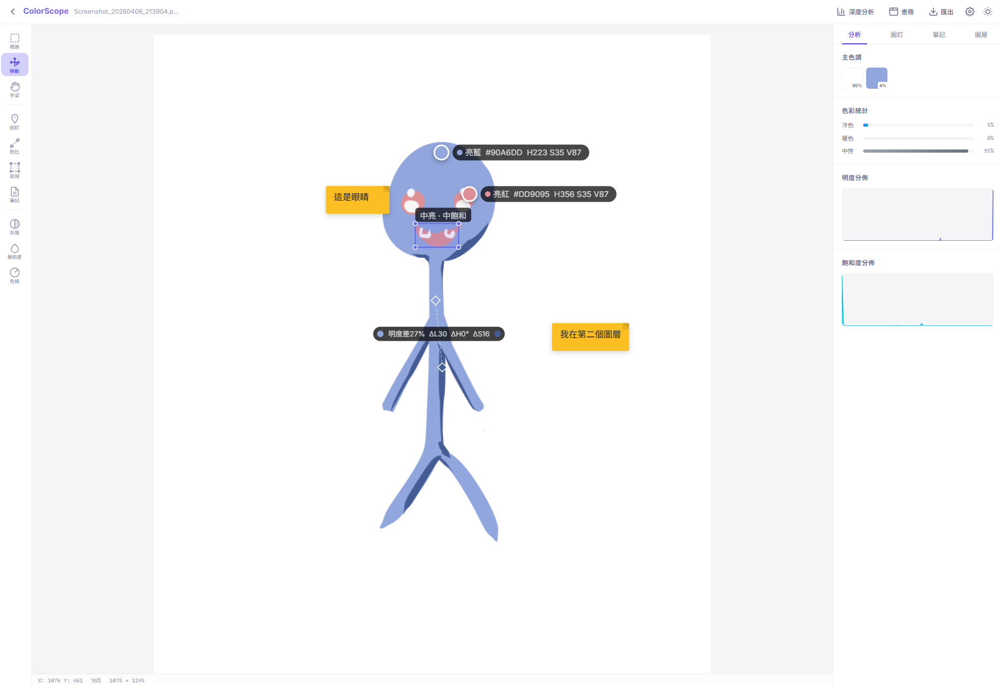
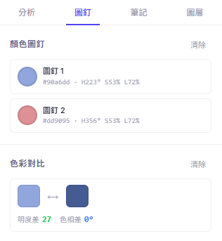
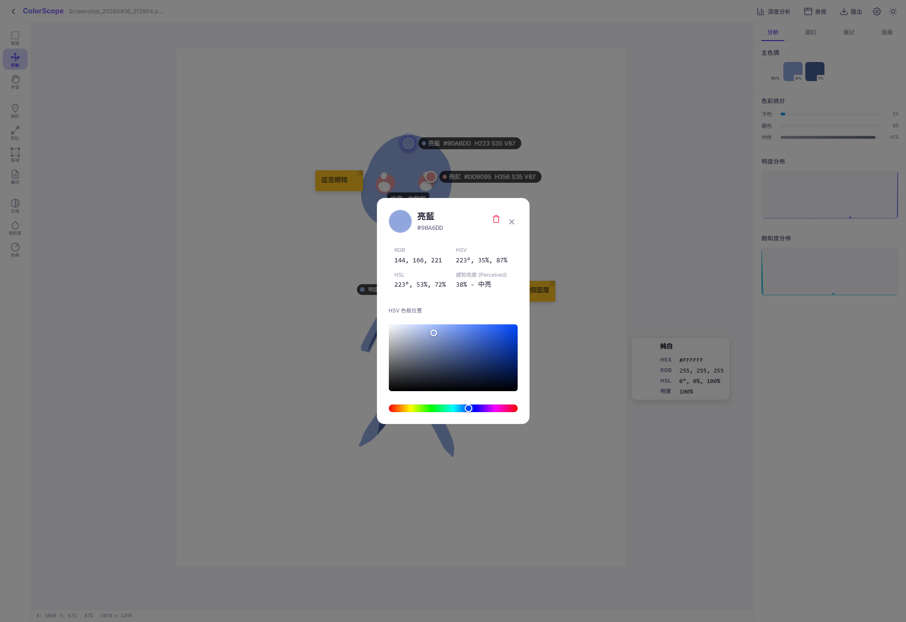
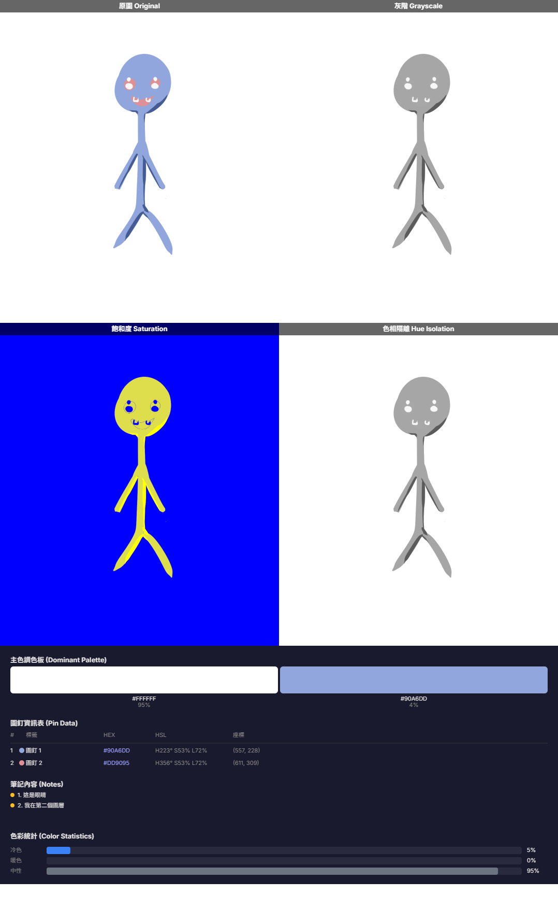
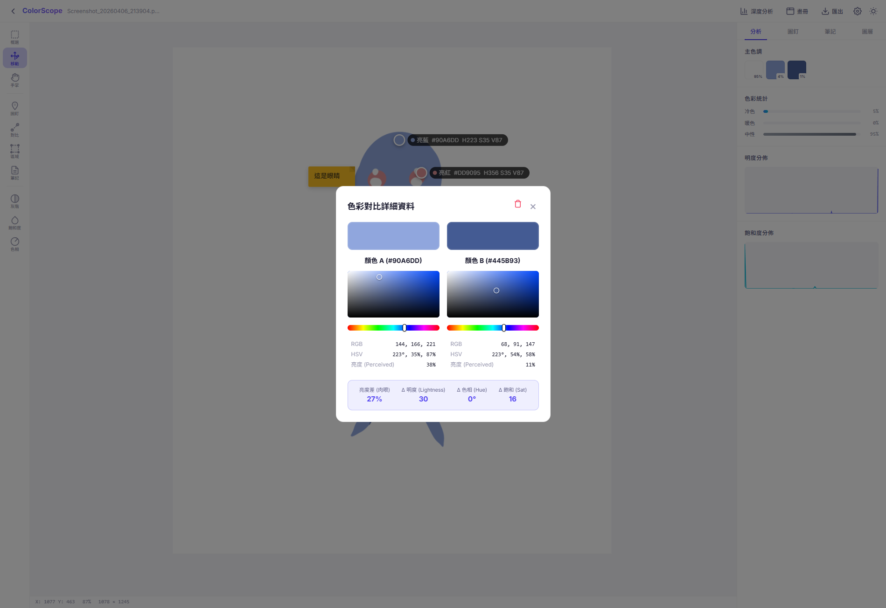
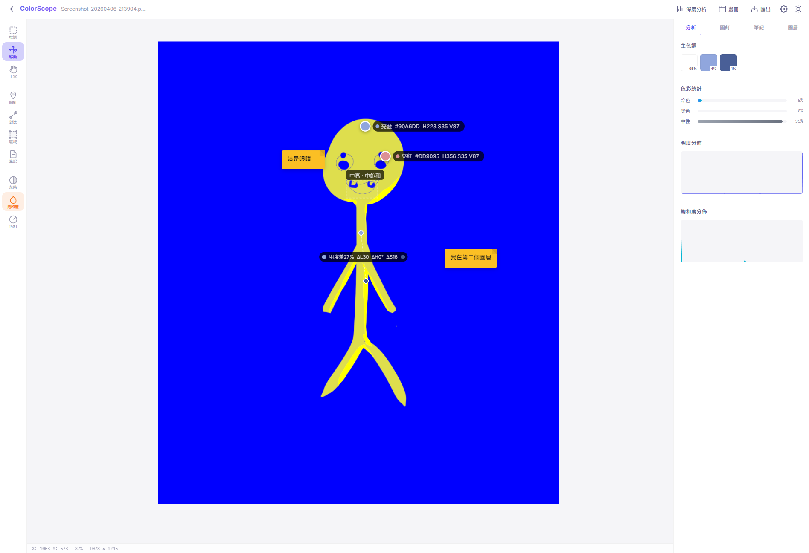
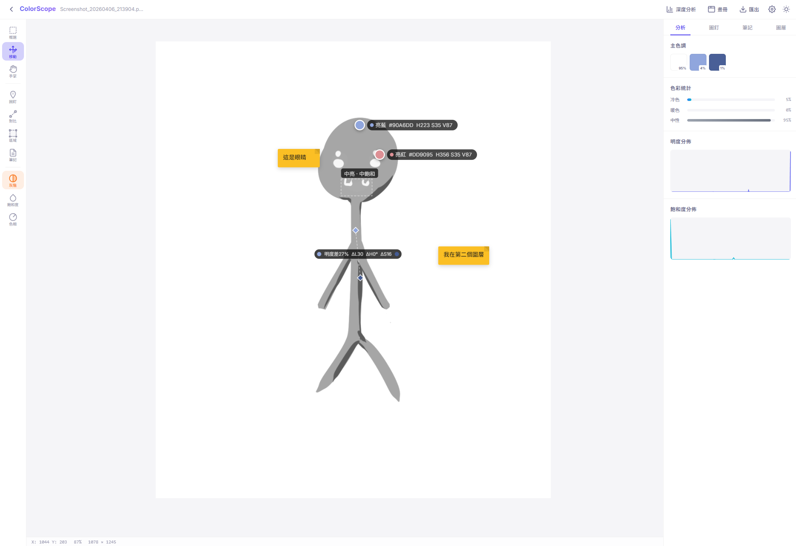
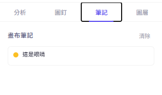
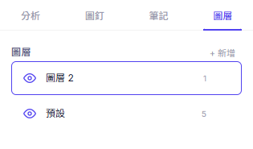

# ColorScope 🎨



**ColorScope** 是一個強大且直覺的網頁端色彩分析與選取工具。幫助設計師、攝影師與開發者精確萃取圖片中的顏色資訊，建立調色板，進行深度色彩分析，甚至是圖層管理與標註。它支援進階的色相隔離、飽和度熱圖，並能自由匯出分析報告。完全在前端執行，無須上傳伺服器，安全且極速！

## ✨ 核心特色 (Features)

### 📌 **精確色彩提取與圖釘 (Color Pins)**
點擊畫面上的任何一處，立即建立圖釘標記，精準分析像素。查看該顏色的 HEX、RGB、HSL 以及明度(Brightness)。支援單點與多點連續標記，輕鬆建立取色樣本。

 &nbsp; 

### 📊 **深度影像分析 (Deep Image Analysis)**
匯入圖片後即可自動萃取影像的「主色調色板」，分析圖片的冷暖色系比例。此外也提供進階數據視圖，生成清晰的明度直方圖 (Brightness Histogram)、飽和度分佈圖 (Saturation Histogram) 以及 HSL 色環分佈圖。



### ⚖️ **動態色彩對比 (Color Comparison)**
透過建立對比線路，針對兩種顏色進行即時比較分析，計算出「色差值 (Delta)」與「明度差」，幫助你確認色彩搭配是否過渡平滑，或者視覺衝擊力是否足夠。支援詳細面板深入檢視差異。



### 👁️ **濾鏡與隔離預覽 (Filter & Isolation)**
無縫切換多種視覺模式，讓隱藏的色彩關係無所遁形。
- **原圖 (Normal)**：標準視覺
- **灰階 (Grayscale)**：移除色相，純看明暗對比布局
- **飽和度熱圖 (Saturation Heatmap)**：視覺化呈現顏色飽和度的強弱
- **色相隔離 (Hue Isolation)**：鎖定特定色相角度範圍，將其他區域變為灰階，迅速捕捉目標色

 &nbsp; 

### 📝 **視覺標註與圖層 (Notes & Layer Rules)**
不僅有圖釘和對比線，你也可以建立色彩便利貼 (Sticky Notes) 為你的畫面加上解釋或想法。所有標記物件都具備圖層 (Layer) 管理概念，支援命名、隱藏以及鎖定。

 &nbsp; 

### 📦 **靈活匯出與報告 (Export & Reporting)**
自訂你的匯出需求。你可以輕鬆選擇匯出的基礎圖片（原圖/灰階/熱圖/四宮格綜合報告），並勾選是否附上畫布標記、主色調色板、圖釘資訊表格、筆記內容等。一鍵產出精美可讀的 PNG / JPG 分析報告。


---

## 🚀 快速開始 (Getting Started)

### 安裝依賴
```bash
npm install
```

### 開發伺服器
```bash
npm run dev
```

### 生產建置
```bash
npm run build
```

---

## 🛠 技術棧 (Tech Stack)

- **核心**: HTML5 Canvas, Vanilla JavaScript (ES Module)
- **建置工具**: Vite
- **UI 與樣式**: Vanilla CSS (CSS Variables, Flexbox/Grid), Glassmorphism 設計
- **圖表與資料**: 自定義 Canvas 圖表, 以及一系列 ColorMath 運算 (HSL, HSV, 感知明度)

---

（免責聲明： 本專案為 AI 生成，僅供實驗或演示用途。代碼按「原樣」提供，不提供任何形式的保證。作者不對因使用本軟體而導致的任何錯誤、安全漏洞或數據損失負責。）
