# ColorScope

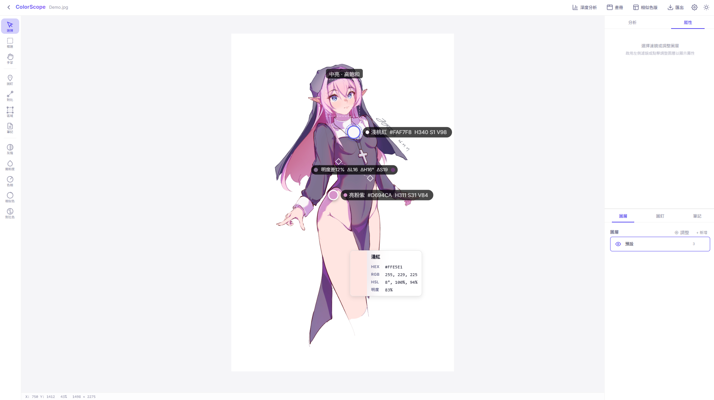

ColorScope 是一套以 Canvas 為核心的色彩檢查與分析工具（Color inspection and analysis toolkit）。
它把取色、比較、濾鏡檢查、色版生成、圖層調整與匯出報告整合在同一個流程中。

## 功能總覽（Features）

### 1. 取色與比對（Color Picking & Comparison）
- 顏色圖釘：可在畫面上標記顏色與位置
- 雙擊色彩詳情：顯示 RGB / HSL / HSV / 明度
- 顏色比較線：快速檢查兩點色差與亮度差

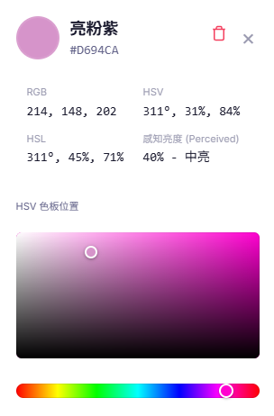
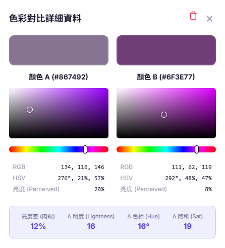

### 2. 濾鏡與色彩檢查（Filter & Isolation Modes）
- 灰階模式（Grayscale）
- 飽和度熱力圖（Saturation Heatmap）
- 色相隔離（Hue Isolation）
- 相似色模式（Analogous）
- 對比色模式（Complementary）

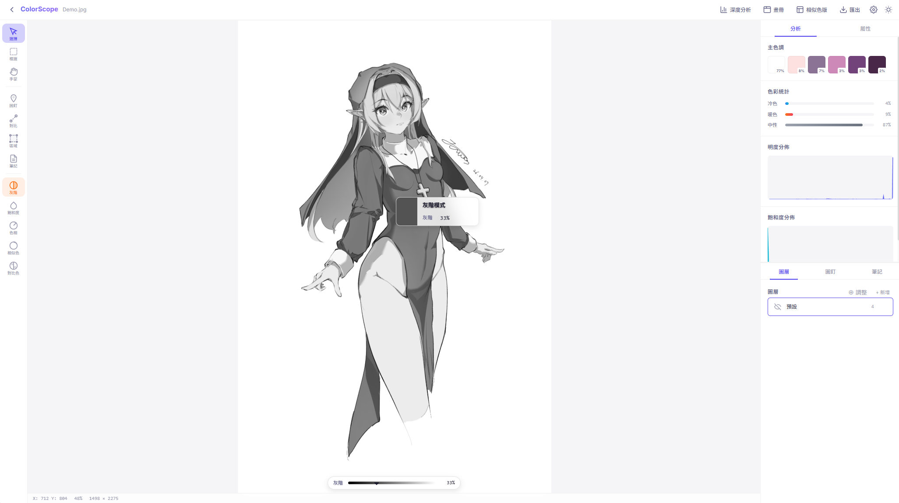
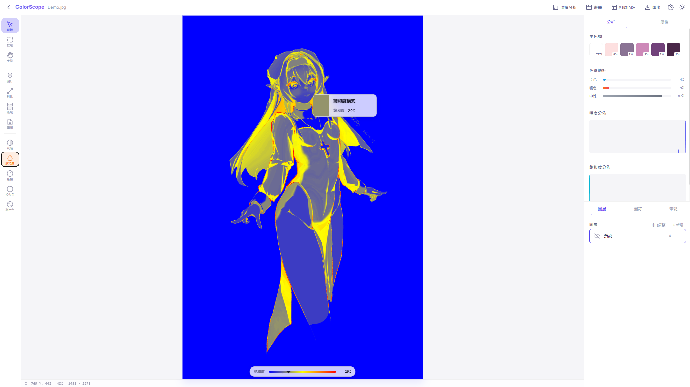
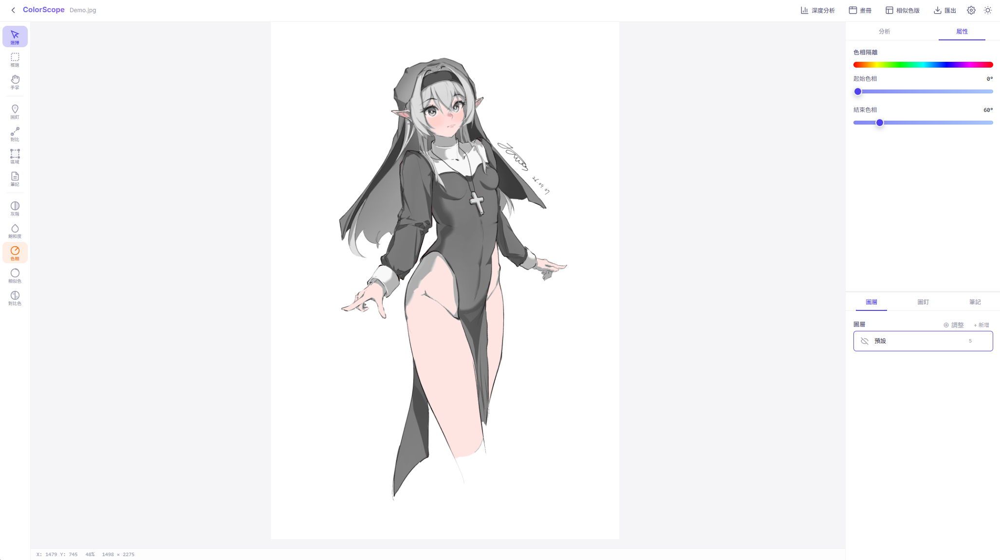
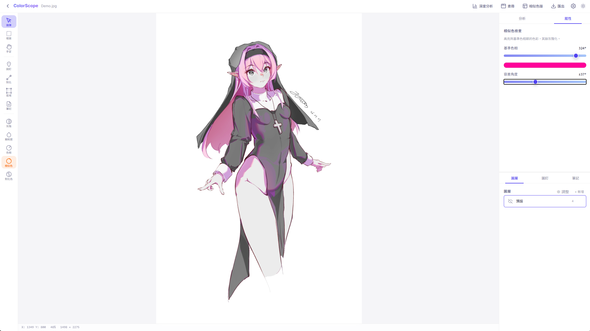
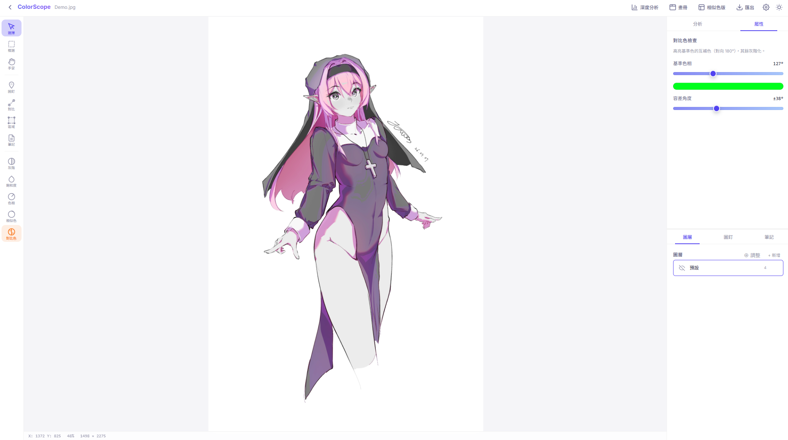

### 3. 深度分析（Deep Analysis）
- 主色盤比例分析（Dominant palette breakdown）
- 明度 / 飽和度分佈（Brightness / Saturation distribution）
- 進階分析視窗（Advanced analysis modal）
- 綜合分析匯出（Comprehensive analysis export）

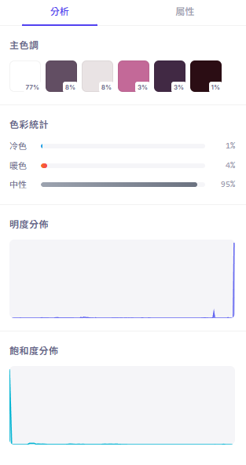
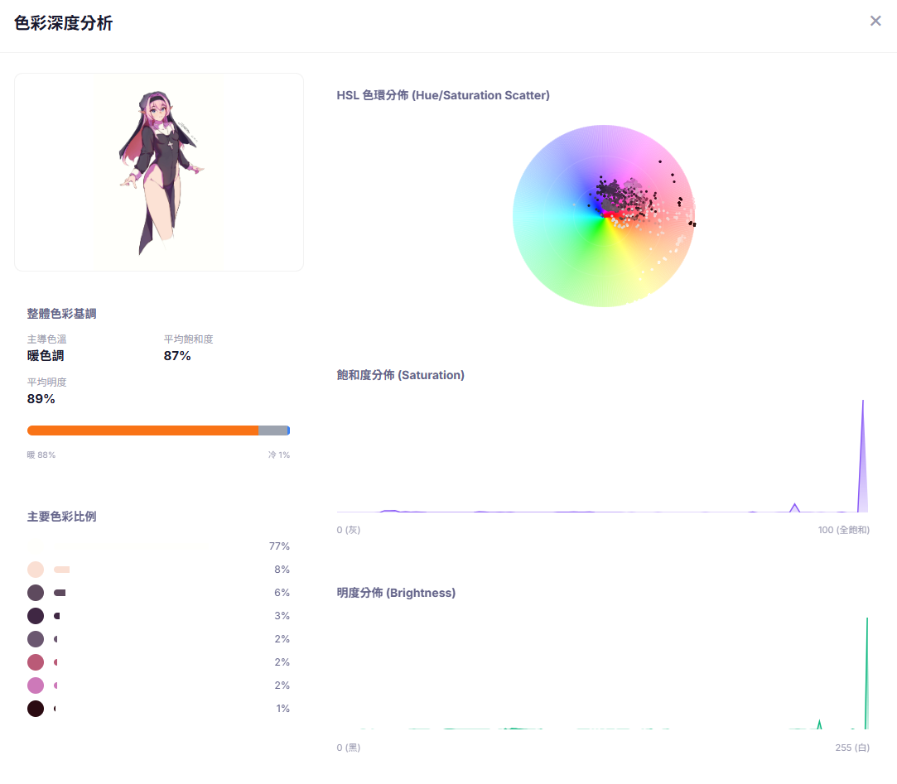
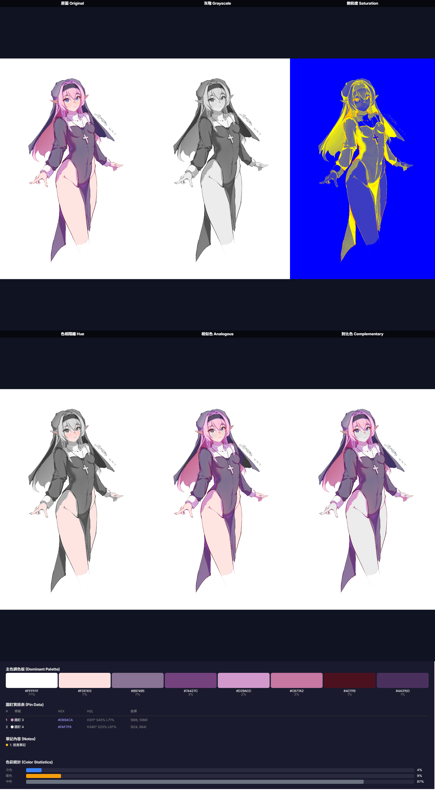

### 4. 圖層與調整圖層（Layers & Adjustment Layers）
- 圖層顯示、排序、刪除
- 調整圖層：HSL、Levels、Curves、Color Balance 等
- 右側面板上下分區可拖曳調整高度

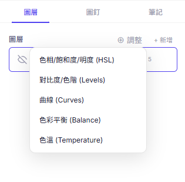

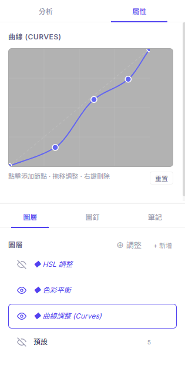 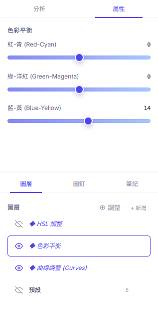


### 5. 色版生成器（Palette Generator）
- 支援隨機、畫布延伸、自訂基準色生成
- 支援 Auto / Analogous / Complementary / Monochromatic / Triadic
- 色塊可雙擊開啟詳情

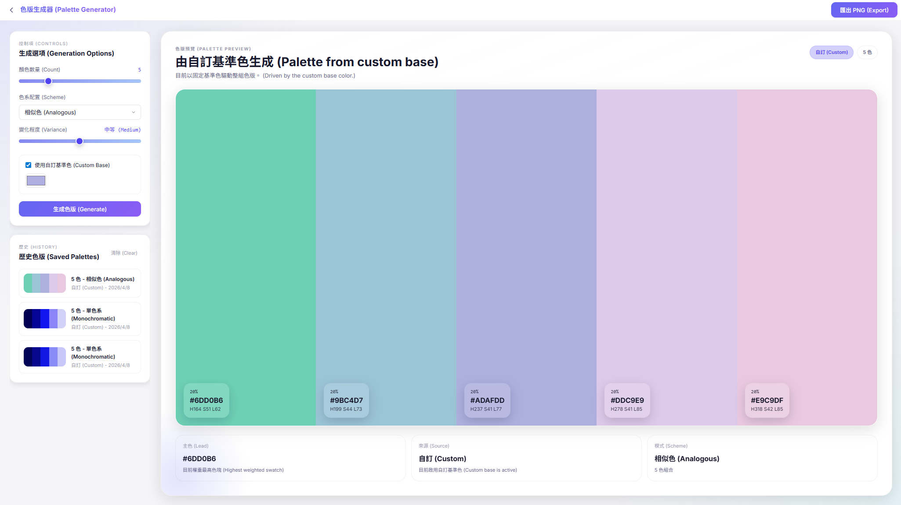
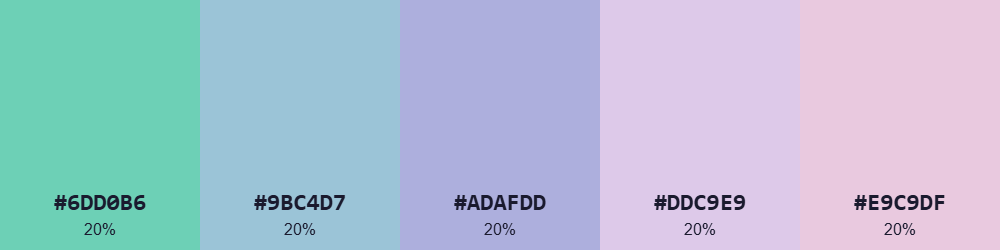

### 6. 匯出與報告（Export & Reporting）
- 支援 PNG / JPG 匯出
- 支援多種匯出來源模式
- 綜合分析匯出含多檢查視圖

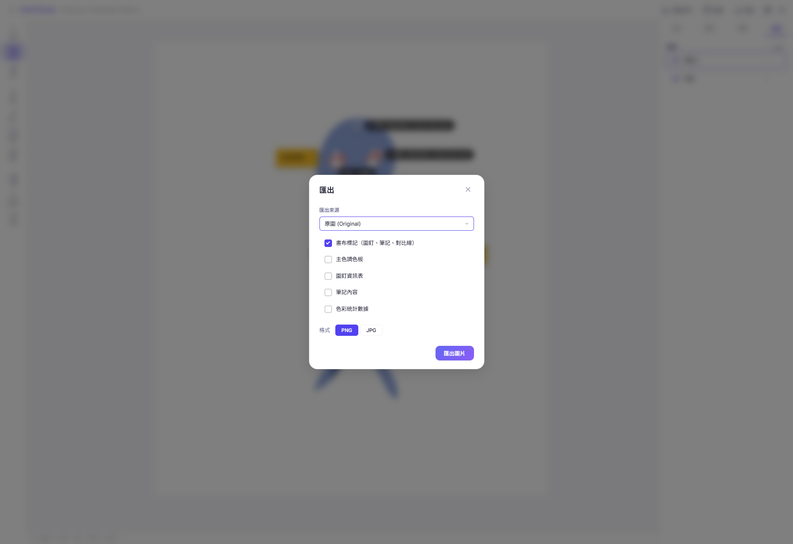
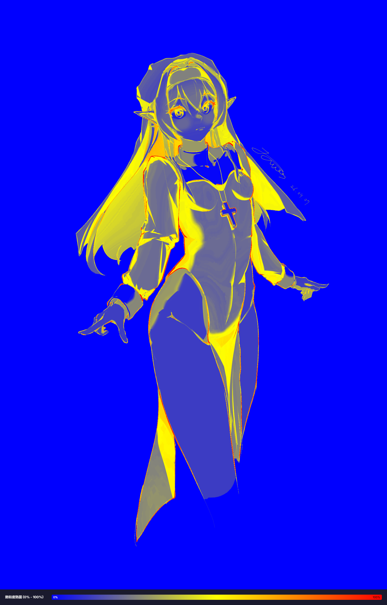

## 狀態保存（State Persistence）

- 每張畫布都會保存自己的狀態（Per-canvas state）
- 色相 / 相似色 / 對比色參數會隨畫布保存並恢復
- 重新開啟同畫布後可直接用一致參數匯出

## 快速開始（Getting Started）

安裝依賴：

```bash
npm install
```

啟動開發環境：

```bash
npm run dev
```

建置正式版本：

```bash
npm run build
```

## 技術棧（Tech Stack）

- Vanilla JavaScript (ES Modules)
- HTML5 Canvas
- Vite
- Vanilla CSS（CSS Variables / Flexbox / Grid）

## 備註（Notes）

- 測試圖片來源為作者本人（All test images are created/provided by me）。
- 此專案由 AI 開發（This project is developed with AI Agent）。
